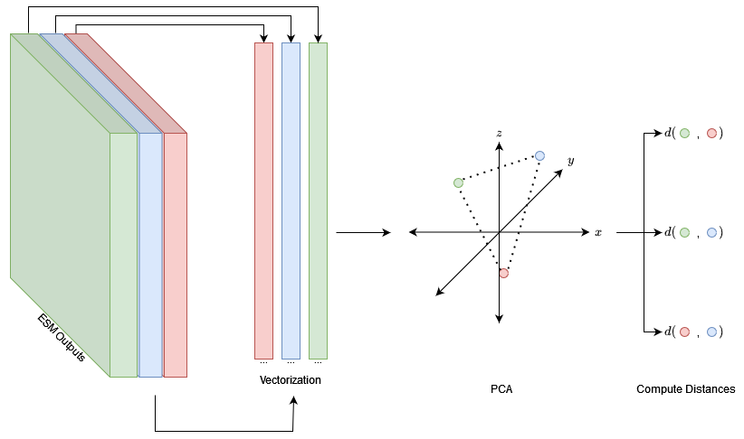
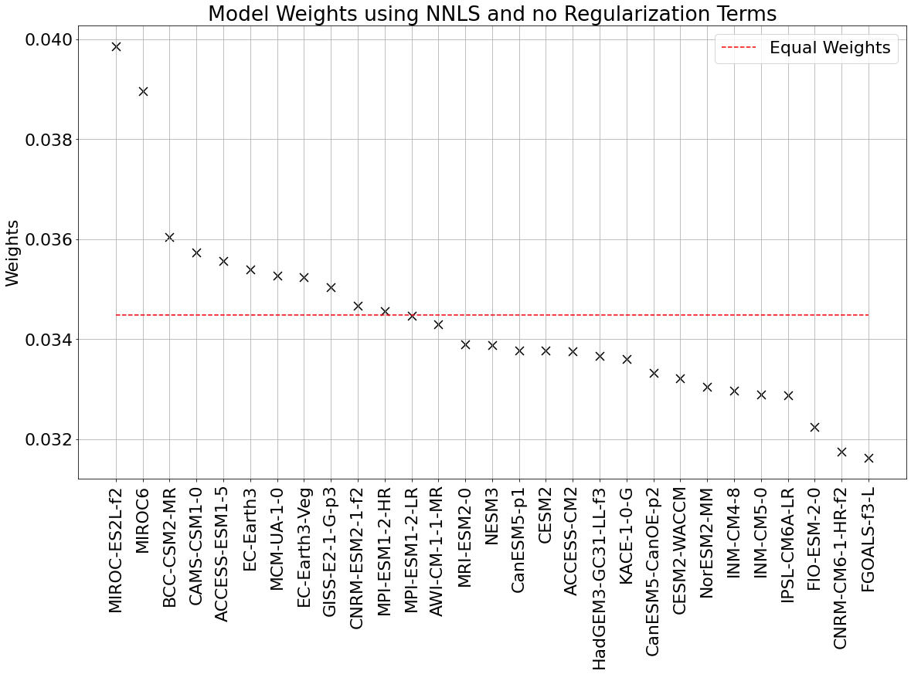
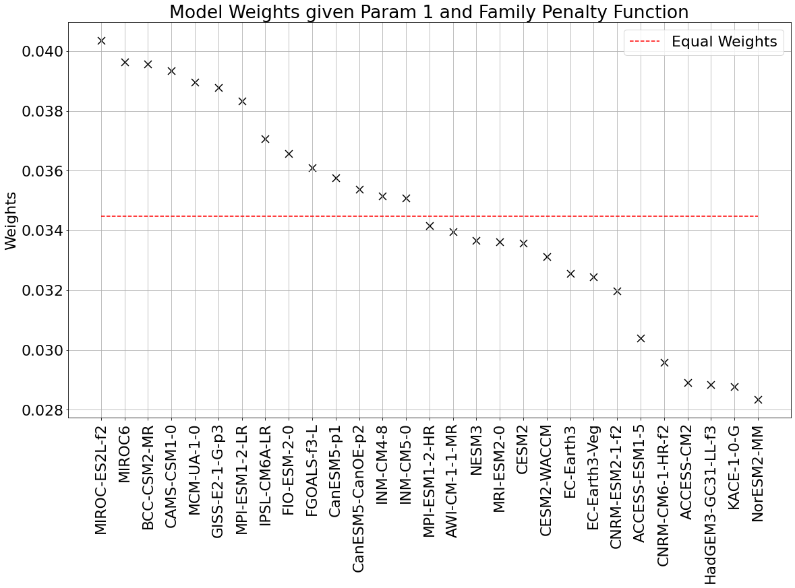
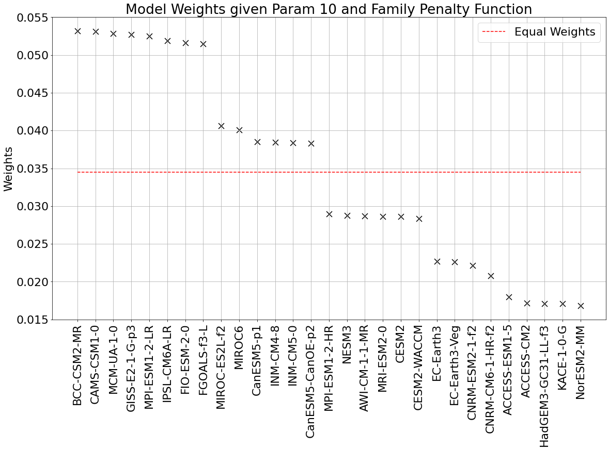
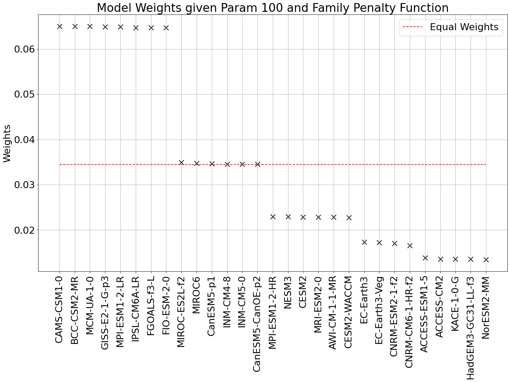

# Penalty-Weighted MME
### A Proof of Concept

A repository containing the source code, data, and written report of my final project for GEOG 652 (Climate Prediction, Modelling, and Scenarios).  
## Installation

If you would like to recreate the main results of this report, please run the following commands in terminal. 
```
git clone https://github.com/svladusic/penalty-weighted-MME.git
conda env create 
conda activate PW_MME
python3 main.py
```

Do note that anaconda and Python >= 3.5 are required to create the relevant virtual environment. I also strongly recommend you use [Libmamba](https://www.anaconda.com/blog/a-faster-conda-for-a-growing-community) as your solver. 

## Extensions, TODO
### Extensions
Ultimately, I am satisfied with the project as it stands. It provides a proof of concept for an alternative method to find weights for MMEs. However, the results of this work could be extended by actually creating some kind of module or class which would allow a user to find weights for MMEs using nothing more than MME data. In particular, the data provided need not be consistently gridded and should be able to handle several climactic variables. Once the data is matched to relevant reanalysis product data, the PWF could be implemented, with users choosing the relevant penalty function. Solving for weights would presumably be done using an ML library rather than a simple, direct implementation of GD.
#### TODO
Again, I am happy with the project as it stands, but it does seem like I began refactoring the code at some point, so that the scripts were PEP8 compliant, and the script functions all had docstrings. I'm not sure what compelled me to do this, but given that I started, I may as well finish!

## Background and Summary of Report
#### Background

The main aim of this report was to explore how custom regularization functions may be used to numerically solve for weights in weighted multi-model ensembles of climate models. 

Climate models vary when making projections of climatic variables, largely due to different implementations and resolutions of underlying earth system processes. In order to account for these differences, climate scientists often combine these model projections together \[2\]. The result of averaging these projections, which together form a so-called multi-model ensemble (MME), is widely thought to provide a new projection that is more reliable than any single constitutive projection.  In principle, MMEs are not restricted to any particular type of averaging. However, most MMEs often form new projections by simply taking the arithmetic mean of each constitutive projection. This is what Knutti et al. call the *democratic approach* - "one model one vote" \[2, 3\]. 

Knutti et al. argue that the democratic approach makes several assumptions about model interdependence and performance, which are unlikely to hold \[3\]. Two[^1] of the key assumptions these models make is that models in MMEs are more-or-less independent, and provide equally plausible projections. However, the authors note that models both share common code, ideas and numerical schemes, and that certain models are worse at presenting mean climate trends. As a result, it is unclear, that these assumptions hold. Furthermore, the authors note that several journal articles suggest that models which share similar ideas and code may bias the results of MMEs.

In order to remedy these concerns, Knutti et al. propose that MME projections should be based on weighted averages of it constitutive models \[2, 3\]. The hope is that by weighing model projections according to their predictive accuracy with respect to a climatic variable, and their interdependence or similarity to other models, an MME can tame the potential biases of the democratic approach. 

Recently, researchers at ETH Zurich including Reno Knutti, Ruth Lorenz, and Lukas Brenner have introduced a weighting framework for MMEs that accounts both for constitutive model performance and interdependence \[1\]. The framework, dubbed climWIP, first embeds model projections in some high dimensional space. Most projections are single variable time series, and can therefore be treated as high dimensional, real valued vectors. Inducing a norm over the relevant vector space allows one to compute distances between model projections. These distances are then used to find model weights, using a rather involved regression procedure outlined in \[1\].

|  |
|:---:|
| *A visualization of how climate projection data from ESMs (Earth System Models) are manipulated to find model distances. Note that the thickness of the ESM outputs is only to convey that there are multiple output variables for each ESM. We also note that principal component analysis can be performed on the collection of vectorized ESM outputs in order to reduce data dimensionality. This step is not necessary, however. Finally, the loading of the PCA in this image is three dimensional only to make the geometric meaning of model distances clear.* |

#### Penalty Weighted MMEs

Although climWIP successfully accounts for model performance and interdependence, we believe there are two potential limitations that confront the framework. First, climWIP casts all weights in a particular parametric form. Second, climWIP treats models that have similar outputs as models which are interdependent (see \[1\]). However, intermodel and observational distances may not captured shared components, code or history between models. As a result, climWIP cannot at present incorporate so called *a priori* interdependence measures (see \[2\] for a summary of this distinction). That is measure of interdependence based on model development rather than model outputs[^2].

As a result, the paper proposes a general framework for weighing MMEs that accounts for both model performance and interdependence. The methodology, called the *penalty weighted framework* (PWF) is inspired by regression analysis and machine learning techniques. In particular, the proposed technique involves solving for weights that minimize a loss function composed of an error function and a penalty function. The error function assesses how well a weighted MME matches observational data. Meanwhile the penalty function behaves something like a regularization function, and is ideally maximized when weights are concentrated in "similar” models. As long the error and penalty functions are sufficiently differentiable, we can find optimal weights via gradient descent. The intuition behind the PWF is that weights found by gradient descent strike the right balance between predictive capabilities, and model independence. 

#### Assessing the PWF: A Proof of Concept

Given the scope of the project, the most important question to ask is whether the PWF actually works, even in a limited capacity. That is, can a penalty weight framework find MME weights which 'reasonably' represent the performance of, and dependence between, models? 

In order to test the performance claim, the report relies on classic statistical inference and machine learning techniques. Using CMIP6 ensemble and MERRA-5 TAS data, the scripts in this repo generate a training and test set, then solve for weights using gradient descent. Testing the performance over several sets of weights is done by computing the accuracy of PWF weighted MMEs using a metric like the root mean squared error (RMSE). 

It is unclear to us how one could quantitatively test for an accurate representation of "dependence” between models. This is also why 'reasonably' appears in scare-quotes in the main research question: to emphasize that the specified means of testing for interdependence are not directly quantitative. Instead, testing for interdependence consists in extrapolating the relationship between weight rankings and magnitudes versus an increase cost associated with penalty functions. Examining these outputs can heuristically determine whether the PWF results in weights that are different than those generated when only considering performance (by considering, for instance, residuals given by a non-negative least squares regression).

#### A Brief Summary of Method and Results
##### Methods
In order to answer if the PWF can represent the performance and interdependence between two models, we implement the PWF over a subset of the CMIP6 ensemble TAS (near-surface air temperature) data between 1980-2015. These serve as the feature variables of our dataset. The target variables consist of TAS data from the MERRA-2 reanalysis product between the same dates. The report considers annualized and monthly-averaged data over a  a 90\*45 longitude/latitude grid.

The error function used in the experiment is the non-negative least squares function, chosen so that model weights are not negative. The report considers two possible penalty functions - a pointwise distance function based on model projections, and a family odds function based on models with  "shared components or the same origin” \[1\]. Optimal weights are found using gradient descent with early stopping. In particular, the original data set is divided into training, validation and test data sets. Gradient descent stops when the validation set loss hasn't improved in five iterations (note: the weights that minimized the loss are returned, not the final weights used in gradient descent).

##### Results
First, note that the pointwise distance penalty ultimately failed at the relevant research task. Ultimately, including this penalty function made little explicable difference in the weighting assigned to each model constituting the pointwise MME. Details about these unfavourable results, and an explanation for the pointwise penalty function's failure can be found in the full report.

However, the results of the family/odds MME form a proof of concept for the PWF. In particular, the plots below demonstrate that as the relevant (hyper)parameter controlling for interdependence importance[^3] increases, model interdependence is the dominant factor when determining model weighting. In particular, the family/odds penalty function groups constitutive models into subsets or "families", and penalizes models which have many "relatives". When the important placed on the penalty function is 100 times greater than the importance placed on the error function, the weights assigned to each constitutive model are almost entirely determined by the size of each model's family.


|  |
|:---:|
|*Weights of each CMIP6 model component with no penalty function. The weights correspond to the coefficients found using non-negative least squares. These weights are found via gradient descent.*|

|  |
|:---:|
|*Weights of each CMIP6 model component when including the family/odds penalty function. Here the error and penalty functions have equal importance in the loss function.*|

|  |
|:---:|
|*Weights of each CMIP6 model component when including the family/odds penalty function. Here the penalty function is ten times as important as the error function when computing the loss.*|

|  |
|:---:|
|*Weights of each CMIP6 model component when including the family/odds penalty function. Here the penalty function is one hundred times as important as the error function when computing the loss.*|

#### Some Conclusions
The relevant question for the report is whether or not the PWF can provide MME weights which 'reasonably' capture model performance and interdependence. Ultimately, the report concludes that the PWF *has* not provided such a set of weights in the foregoing analysis, but that the results indicate the framework *could* do so. The data analyzed in the report only consists in TAS data, but noted by Knutti, different models are better at forecasting different variables. Consequently, any data set providing reasonable MME weights would contain data on many more climactic variables. However, the family/odds penalty function adequately captures some form of model interdependence given the limiting behaviour present in the plots of the *Results* subsection. In particular, it is clear that by raising or lowering the importance of the penalty function, the relevance of model interdependence increases or decreases, respectively. This suggests when both components of the loss function are close to equally weighed, that the resulting loss function accounts for results and model interdependence. Perhaps an MME given by the PWF and the family/odds function would provide a useful sets of weights if trained on more robust data, and if there were a more systematic means for testing our rather slippery notion of ‘reasonability’.

#### Footnotes
[^1]:  Do note that the original paper presents four issues with the democratic approach. However, only two of these points were essential to cover in this exposition.

[^2]: Although figure 5 in \[1\] strongly suggests that climWIP nevertheless does a good job of representing a priori interdependence measures.

[^3]:  The relevant hyperparameter, $\lambda$, is entirely analogous to L1/L2 regularization hyperparameters. More details concerning the hyperparameter can be found in the full report. 

#### References
\[1\] L. Brunner, A. G. Pendergrass, F. Lehner, A. L. Merrifield, R. Lorenz, and R. Knutti. Reduced global warming from cmip6 projections when weighting models by performance and independence. *Earth System Dynamics*, 11(4):995–1012, 2020.

\[2\] Reto Knutti. The end of model democracy? *Climatic Change*, 102(3-4):395–404, 2010.

\[3\] Reto Knutti, Jan Sedlácek, Benjamin M. Sanderson, Ruth Lorenz, Erich M. Fischer, and Veronika Eyring. A climate model projection weighting scheme accounting for performance and interdependence. *Geophysical Research Letters*, 44(4):1909–1918, 2017.
